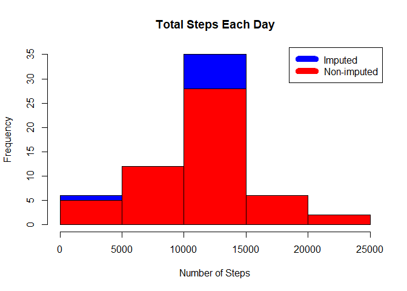
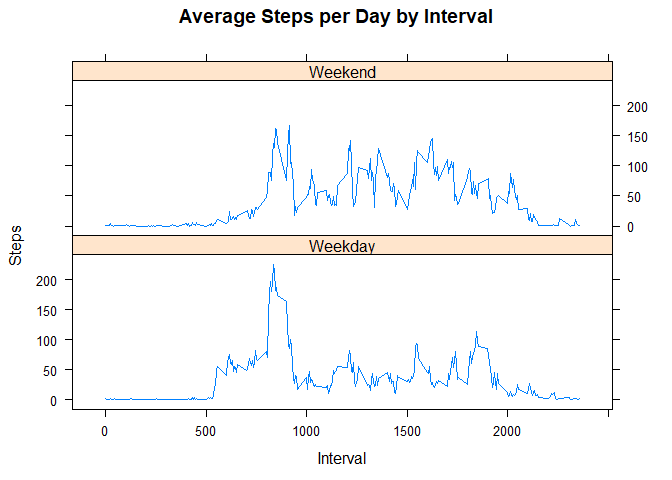

# Reproducible Research: Peer Assessment 1


## Loading and preprocessing the data
***
#####Download and unzip the data 

```r
#Checks if the file exists and unzip into the directory
filename <- "activity.zip"
if (file.exists(filename)){
  unzip(filename)
}
```
#####Load data into data frame **activityData**

```r
#Read the data and process it to remove unwanted chunk
if(!exists("activityData")){
  if(file.exists("activity.csv")){
  activityData<-read.csv("activity.csv")
}
}
```


## What is mean total number of steps taken per day?
***
#####Estimate the total steps by day

```r
library(ggplot2)
#Calculate total steps by day
stepsByDay <- tapply(activityData$steps, activityData$date, sum, na.rm=TRUE)
```
#####Plot the histogram

```r
#Plot the histogram
qplot(stepsByDay, xlab='Total steps per day', ylab='Frequency using binwith 500', binwidth=500)
```

<!-- -->
```
Histogram shows the total number of steps per day over the mean  
```

```r
#Calculate the mean and median
stepsByDayMean <- mean(stepsByDay, na.rm = TRUE)
stepsByDayMedian <- median(stepsByDay,na.rm = TRUE)
```

```
Output:
  * Mean : 9354.2295082
  * Median:  10395
```

## What is the average daily activity pattern?
***
```
*Calculate average steps for each interval for all days.
*Plot the Average Number Steps per Day by Interval.
*Find interval with most average steps.
```


```r
library(ggplot2)
averageStepsPerTimeBlock <- aggregate(steps~interval, activityData,FUN=mean, na.rm=TRUE)
ggplot(data=averageStepsPerTimeBlock, aes(x=interval, y=steps)) +
    geom_line() +
    xlab("5-minute interval") +
    ylab("average number of steps taken") 
```

<!-- -->


```r
#Maximum number of steps at interval
averageStepsPerTimeBlock[which.max(averageStepsPerTimeBlock$steps), ]
```

```
##     interval    steps
## 104      835 206.1698
```

```
The 5-minute interval, on average across all the days in the data set, containing the maximum number of steps is 835.
```

## Imputing missing values
***
#####Missing data needed to be imputed. Missing values were imputed by inserting the average for each interval.

```r
incomplete <- sum(!complete.cases(activityData))
imputed_data <- transform(activityData, steps = ifelse(is.na(activityData$steps), averageStepsPerTimeBlock$steps[match(activityData$interval, averageStepsPerTimeBlock$interval)], activityData$steps))
imputed_data[as.character(imputed_data$date) == "2012-10-01", 1] <- 0
steps_by_day_i <- aggregate(steps ~ date, imputed_data, sum)
hist(steps_by_day_i$steps, main = paste("Total Steps Each Day"), col="blue", xlab="Number of Steps")
steps_by_day <- aggregate(steps ~ date, activityData, sum)
hist(steps_by_day$steps, main = paste("Total Steps Each Day"), col="red", xlab="Number of Steps", add=T)
legend("topright", c("Imputed", "Non-imputed"), col=c("blue", "red"), lwd=10)
```

<!-- -->

#####Calculate new mean  median for imputed data & Total difference

```r
#Calculate new mean and median for imputed data.
rmean.i <- mean(steps_by_day_i$steps)
rmedian.i <- median(steps_by_day_i$steps)

mean_diff <- rmean.i - stepsByDayMean
med_diff <- rmedian.i - stepsByDayMedian

#Calculate total difference.
total_diff <- sum(steps_by_day_i$steps) - sum(steps_by_day$steps)
```

```
*The imputed data mean is 1.059 × 104
*The imputed data median is 1.0766 × 104
*The difference between the non-imputed mean and imputed mean is -176.4949
*The difference between the non-imputed mean and imputed mean is 1.1887
*The difference between total number of steps between imputed and non-imputed data is 7.5363 × 104. Thus, there were 7.5363 × 104 more steps in the imputed data.
```
## Are there differences in activity patterns between weekdays and weekends?
***
#####Created a plot to compare and contrast number of steps between the week and weekend. There is a higher peak earlier on weekdays, and more overall activity on weekends.

```r
weekdays <- c("Monday", "Tuesday", "Wednesday", "Thursday", 
              "Friday")
imputed_data$dow = as.factor(ifelse(is.element(weekdays(as.Date(imputed_data$date)),weekdays), "Weekday", "Weekend"))

steps_by_interval_i <- aggregate(steps ~ interval + dow, imputed_data, mean)

library(lattice)

xyplot(steps_by_interval_i$steps ~ steps_by_interval_i$interval|steps_by_interval_i$dow, main="Average Steps per Day by Interval",xlab="Interval", ylab="Steps",layout=c(1,2), type="l")
```

<!-- -->
